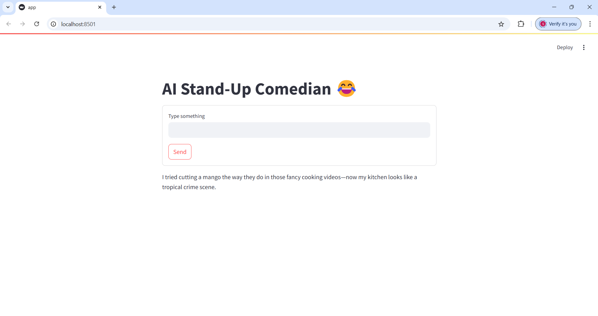

# AI Stand-Up Comedian Chatbot Using OpenAI and Streamlit 🤖

This project leverages **OpenAI's GPT-4o models** and **Streamlit** to create an interactive AI chatbot that delivers stand-up comedy performances.

##  Prerequisites and Setup Instructions 🚀

### **1. Install Python** 🐍

Ensure Python 3.11 or later is installed. If Python is not already installed, follow these steps:

- For a detailed guide on how to install Python on different operating systems, refer to the [Quick Guide for Installing Python](https://github.com/PackeTsar/Install-Python/blob/master/README.md#install-python-).
- The latest version of Python can be downloaded from the official website: [Download Python](https://www.python.org/downloads/).

Verify the installation:

```bash
python --version
```

### **2. Create a Virtual Environment** 💻

Creating a virtual environment is recommended to manage dependencies for the project.

- **For Windows**:
    ```bash
    python -m venv venv
    ```

- **For MacOS/Linux**:
    ```bash
    python3 -m venv venv
    ```

### **3. Activate the Virtual Environment** 🔑

After creating the virtual environment, it needs to be activated:

- **For Windows**:
    ```bash
    venv\Scripts\activate
    ```

- **For MacOS/Linux**:
    ```bash
    source venv/bin/activate
    ```

After activation, the terminal prompt should display `(venv)` at the beginning.

### **4. Install Project Dependencies** 📦

Install the required libraries listed in the `requirements.txt` file:

```bash
pip install -r requirements.txt
```

For MacOS/Linux, use `pip3` if necessary:

```bash
pip3 install -r requirements.txt
```

### **5. Obtain an OpenAI API Key** 🔑

An API key from OpenAI is required to access GPT models. Follow these steps:

1. Go to the [OpenAI API Keys](https://platform.openai.com/account/api-keys) page.
2. Log in or create an account.
3. Generate and copy the API key.

### **6. Configure the API Key** 🔧

Set up the API key for the project by creating a `.env` file in the root directory and adding the following line:

```
OPENAI_API_KEY=your_api_key_here
```

Alternatively, the API key can be exported in the terminal session:

- **For Windows**:
    ```bash
    set OPENAI_API_KEY=your_api_key_here
    ```

- **For MacOS/Linux**:
    ```bash
    export OPENAI_API_KEY='your_api_key_here'
    ```

##  Start the Application ▶️

Run the chatbot application using Streamlit:

```bash
streamlit run app.py
```

The application will launch in the default web browser and can be accessed at `http://localhost:8501`.


## Contributing 💡

Contributions are welcome through forks and pull requests. Follow the contribution guidelines and ensure the code is well-documented.


## License 📜

This project is licensed under the [MIT License](LICENSE).
